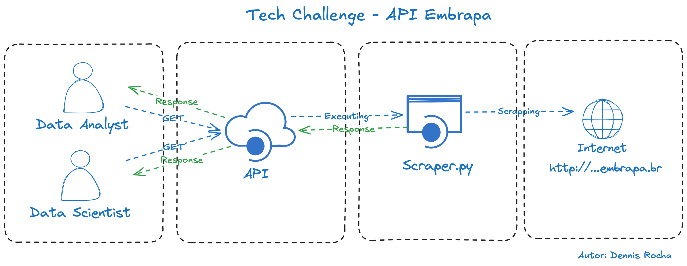

# Tech Challenge - API de Vitivinicultura da Embrapa 🍇

Tech Challenge é o projeto da fase que englobará os conhecimentos obtidos em todas as disciplinas da fase.

Este projeto é uma API RESTful desenvolvida em Python com FastAPI, que realiza web scraping no site da Embrapa para coletar dados de vitivinicultura (Produção, Processamento, Comercialização, Importação e Exportação).  


## O Problema

Você foi contratado(a) para uma consultoria e seu trabalho envolve analisar os dados de vitivinicultura da Embrapa, os quais estão disponíveis no link abaixo:

Site de origem dos dados: [http://vitibrasil.cnpuv.embrapa.br/index.php](http://vitibrasil.cnpuv.embrapa.br/index.php)

## Funcionalidades

**Endpoints** para acessar dados das diferentes abas da Embrapa:  
- `/producao`  
- `/processamento`  
- `/comercializacao`  
- `/importacao`  
- `/exportacao`  

✅ **Tratamento de erros** com mensagens padronizadas.  
✅ **Logs** para facilitar o monitoramento e a depuração.  
✅ Estrutura modular e clara, separando scraping e API.  

---
## Diagrama de Arquitetura



---

#### Coleta de Dados:
- Web Scraper ➔ Dados brutos
#### Mapeamento e Processamento:
- Alias e mapeamento de parâmetros
#### API:
- Endpoints de consulta de dados
#### Consumo:
- Dashboards ou integrações

## Requisitos

- **Python 3.7 ou superior**
- **pip** (gerenciador de pacotes)

## Dependências

- **fastapi**
- **selenium**
- **uvicorn**

## Como executar localmente

1. Clone o repositório

```bash
git clone https://github.com/https://github.com/rochadennis/FIAP_5MLET_Tech_Challenge_Embrapa.git
cd FIAP_5MLET_Tech_Challenge_Embrapa
```

2. Crie o ambiente virtual

```bash
python3 -m venv venv
source venv/bin/activate  # Linux/macOS
venv\Scripts\activate     # Windows
```


3. Instale as dependências  
```bash
pip install -r requirements.txt
```

4. Execute a aplicação  
```bash
uvicorn main:app --reload
```  

✅ A API estará disponível em: http://localhost:8000

Documentação automática:  
Swagger UI: http://localhost:8000/docs  
ReDoc: http://localhost:8000/redoc

## Respostas:
**200 OK:** Retorna os dados solicitados.

**400 Bad Request:** O tipo de dados ou subopção solicitada é inválido.

**500 Internal Server Error:** Ocorreu um erro ao buscar os dados.

### Exemplos de Requisição
   ```bash
   curl -X GET "http://127.0.0.1:8000/producao" -H "accept: application/json"
   ```

   ```bash
   curl -X GET "http://localhost:8000/processamento" -H "accept: application/json"
   ```

### Estrutura do projeto
```plaintext
.  
├── main.py          # Código principal da API  
├── scraper.py       # Funções de scraping com Selenium  
├── requirements.txt # Lista de dependências  
└── README.md        # Este arquivo  
```

### Autenticação 🔐 
Atualmente, a API está aberta (não há autenticação).
Para ambientes de produção, recomenda-se adicionar autenticação JWT ou similar.

### Observações importantes
O scraping depende da estrutura HTML do site da Embrapa. Mudanças no site podem exigir ajustes no código.
É necessário ter o ChromeDriver ou GeckoDriver instalado e compatível com a versão do navegador Chrome/Firefox.

### Referências
FastAPI
Selenium
Embrapa Vitibrasil

### Autor 👨‍💻
Desenvolvido por: Dennis Rocha. [(Linkedin)](https://www.linkedin.com/in/dennissrocha/)